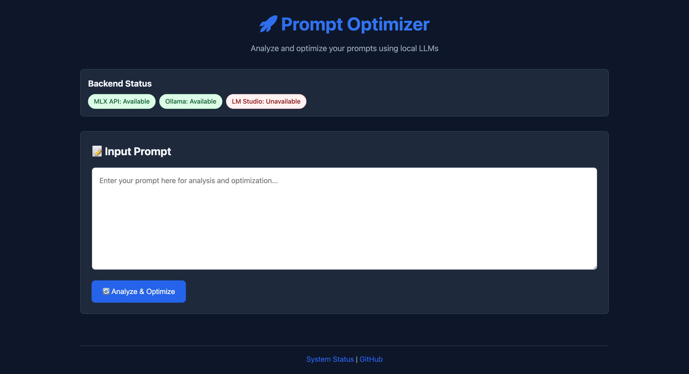
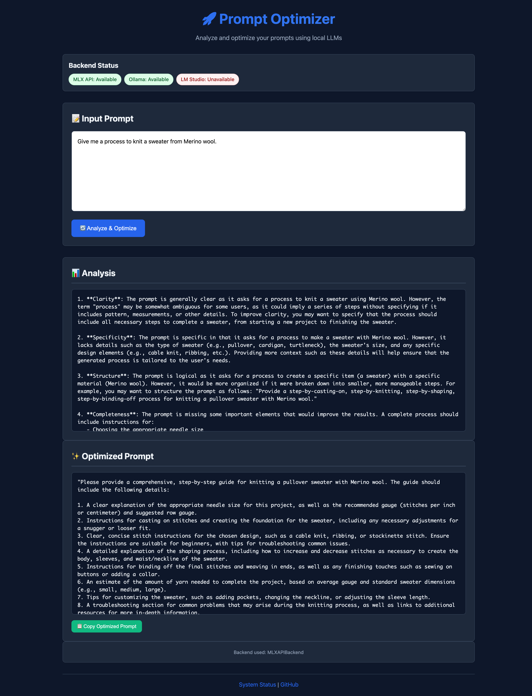

# Prompt Optimizer

A simple web application for analyzing and optimizing prompts using local LLMs. Supports MLX (Apple Silicon), Ollama, and LM Studio backends with automatic backend detection.



2-part Prompt optimizer from [Frequent_Limit337](https://www.reddit.com/r/ChatGPTPromptGenius/comments/1ktjk0p/i_build_a_prompt_that_can_make_any_prompt_10x/) on Reddit. I have made some changes to part 1, but not to part 2.

- another variant:
  - https://www.reddit.com/r/ChatGPTPromptGenius/comments/1jfe7mu/turn_any_prompt_into_the_perfect_prompt_with_this/

Also made use of the following web references:

<https://medium.com/@lukekerbs/goodbye-api-keys-hello-local-llms-how-i-cut-costs-by-running-llm-models-on-my-m3-macbook-a3074e24fee5>

<https://stackoverflow.com/questions/64810921/kubernetes-official-tutorial-the-web-page-at-http-localhost6000-might-be-te>

This app was heavily assisted by Github Copilot with Claude Sonnet 4.




## 🚀 Quick Start

### One-Command Launch (Recommended)

1. **Setup (first time only):**
   ```bash
   # Clone/download the project and navigate to it
   cd prompt-optimizer
   
   # Create virtual environment
   python -m venv venv
   
   # Activate virtual environment
   source venv/bin/activate
   
   # Install dependencies
   pip install -r requirements.txt
   ```

2. **Launch everything with one command:**
   ```bash
   ./launch.sh
   ```
   
   This script will:
   - Start the MLX server (port 8080)
   - Start the Flask web app (port 5001)
   - Open your default browser to the app
   - Handle cleanup when you press Ctrl+C

### Manual Setup (Alternative)

1. **Create and activate a virtual environment:**
   ```bash
   # Create virtual environment
   python -m venv venv
   
   # Activate virtual environment
   source venv/bin/activate  # On macOS/Linux
   # Or on Windows: venv\Scripts\activate
   ```

2. **Install dependencies:**
   ```bash
   pip install -r requirements.txt
   ```

3. **Start MLX server (in one terminal):**
   ```bash
   python -m mlx_lm.server --model mlx-community/Mistral-7B-Instruct-v0.3-4bit --host 127.0.0.1 --port 8080
   ```

4. **Start the web app (in another terminal):**
   ```bash
   source venv/bin/activate  # Activate venv again in new terminal
   python app_mlx_api.py
   ```

5. **Open your browser:**
   ```
   http://127.0.0.1:5001
   ```

6. **When finished, stop both processes with Ctrl+C and deactivate:**
   ```bash
   deactivate
   ```

### Docker Deployment

1. **Using Docker Compose (with Ollama):**
   ```bash
   docker-compose up -d
   ```

2. **Using Docker only:**
   ```bash
   docker build -t prompt-optimizer .
   docker run -p 6000:6000 prompt-optimizer
   ```

## 🎯 Features

- **Multi-Backend Support**: Automatically detects and uses available LLM backends
- **Two-Step Optimization**: Analyzes prompts first, then optimizes based on analysis
- **Clean Web Interface**: Simple, responsive design for easy prompt input and results viewing
- **Copy to Clipboard**: One-click copying of optimized prompts
- **Real-time Status**: Shows which backends are available
- **Containerized**: Ready for Docker deployment

## 🔧 Configuration

### Environment Variables

Create a `.env` file from `.env.example`:

```bash
cp .env.example .env
```

Key configuration options:

- `LLM_BACKEND`: Choose backend (`auto`, `mlx`, `ollama`, `lmstudio`)
- `MLX_MODEL`: MLX model to use (Apple Silicon only)
- `OLLAMA_URL`: Ollama server URL
- `LMSTUDIO_URL`: LM Studio server URL

### Backend Priority

When `LLM_BACKEND=auto` (default), the app selects backends in this order:
1. **MLX** (if available on Apple Silicon)
2. **Ollama** (if running)
3. **LM Studio** (if running)

## 📁 Project Structure

```
prompt-optimizer/
├── app.py                 # Main Flask application (MLX API version)
├── app_legacy.py          # Legacy Flask app (direct MLX integration)
├── launch.sh              # One-command launcher script
├── templates/
│   └── index.html         # Web interface
├── static/
│   └── style.css          # Styling
├── docs/                  # Documentation
├── requirements.txt       # Python dependencies
├── Dockerfile            # Container configuration
├── docker-compose.yml    # Multi-service setup
├── .env.example          # Environment template
└── README.md             # This file
```

## 🖥️ Backend Setup

### MLX (Apple Silicon) - Primary Backend

The recommended setup uses MLX as a separate API server:

```bash
# Start MLX server (included in launch.sh)
python -m mlx_lm.server --model mlx-community/Mistral-7B-Instruct-v0.3-4bit --host 127.0.0.1 --port 8080

# The Flask app connects to this server via HTTP API
# This is the recommended approach from the MLX community
```

**Note:** The app runs on port 5001 (not 6000) to avoid Chrome's X11 port restrictions.

### Ollama

```bash
# Install Ollama
curl -fsSL https://ollama.ai/install.sh | sh

# Pull a model
ollama pull llama2

# Start Ollama (runs on http://localhost:11434)
ollama serve
```

### LM Studio

1. Download and install [LM Studio](https://lmstudio.ai/)
2. Load a model in LM Studio
3. Start the local server (typically http://localhost:1234)

## 🔄 Usage Workflow

1. **Enter your prompt** in the text area
2. **Click "Analyze & Optimize"** to process
3. **Review the analysis** to understand prompt strengths/weaknesses
4. **Use the optimized prompt** for better LLM results
5. **Copy optimized prompt** to clipboard with one click

## 🐳 Docker Notes

- The Docker container uses Ollama by default (MLX isn't available in containers)
- Use `docker-compose.yml` for a complete setup with Ollama included
- For MLX support, run natively on macOS

## 🛠️ Development

### Running in Development Mode

```bash
# Activate your virtual environment first
source venv/bin/activate

# Install development dependencies
pip install -r requirements.txt

# Set development environment
export FLASK_ENV=development

# Run with auto-reload
python app.py
```

### API Endpoints

- `GET /`: Main web interface
- `POST /api/optimize`: Optimize a prompt (JSON API)
- `GET /api/status`: Check backend status

### Adding New Backends

1. Create a new backend class inheriting from `LLMBackend`
2. Implement `generate()` and `is_available()` methods
3. Add to the backend selection logic in `PromptOptimizer`

## 📝 Example

**Input Prompt:**
```
Write a story about a robot.
```

**Analysis Output:**
```
The prompt lacks specificity and context. It would benefit from:
1. Defining the robot's characteristics
2. Specifying the story genre or tone
3. Adding constraints like length or target audience
...
```

**Optimized Prompt:**
```
Write a 500-word science fiction story about a maintenance robot 
who discovers emotions while working alone on a space station. 
Include themes of isolation and self-discovery. Target audience: 
young adults. Tone: contemplative and hopeful.
```

## 🤝 Contributing

1. Fork the repository
2. Create a feature branch
3. Make your changes
4. Test with multiple backends
5. Submit a pull request

## 📄 License

MIT License - see LICENSE file for details

## 🙋‍♂️ Support

- Check `/api/status` endpoint for backend availability
- Ensure your LLM backend is running and accessible
- Review logs for detailed error information
